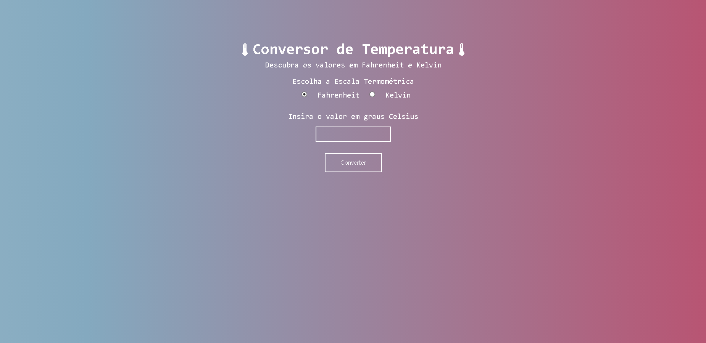

# Imersão Dev - Mentalist Challenge

This is the solution to Imersão Dev's Mentalist Challenge.

## Table of contents

- [Overview](#overview)
  - [The challenge](#the-challenge)
  - [Screenshot](#screenshot)
  - [Links](#links)
- [My process](#my-process)
  - [Built with](#built-with)
  - [What I learned](#what-i-learned)
  - [Useful resources](#useful-resources)

## Overview

### The challenge

The Mentalist Challenge, proposed by Alura during Imersão Dev, consists in a guessing game where the program chooses a random number between 1 to 10 that must be guessed by the user, whom has 5 tries to guess the correct number.

### Screenshot



### Links

- Live Site URL: [https://izuca.github.io/imersaoDev-Mentalista/](https://izuca.github.io/imersaoDev-Mentalista/)
- Codepen's base project: [https://codepen.io/imersao-dev/pen/vYgBwoj](https://codepen.io/imersao-dev/pen/vYgBwoj)

## My process

### Built with

- HTML 5
- CSS 3
- Javascript
- Codepen

### What I learned

- How to fork projects

- Making tests using console.log

- Creating the guessing logic with if and else

- How to use the Javascript's Math.random function to generate random numbers

- How to use an animated background
```css
body{
  background: url(https://i.giphy.com/media/PjJ1cLHqLEveXysGDB/source.gif?cid=ecf05e4722nazj44oilpqk0jmix90wt57ogo6fehxrrrkjmt&rid=source.gif&ct=g),black;
}
```

### Useful resources

- [W3Schools](https://www.w3schools.com/default.asp)
- [MDN Web Docs](https://developer.mozilla.org/pt-BR/)
- [Codepen](https://codepen.io)
- [Alura](https://www.alura.com.br)
